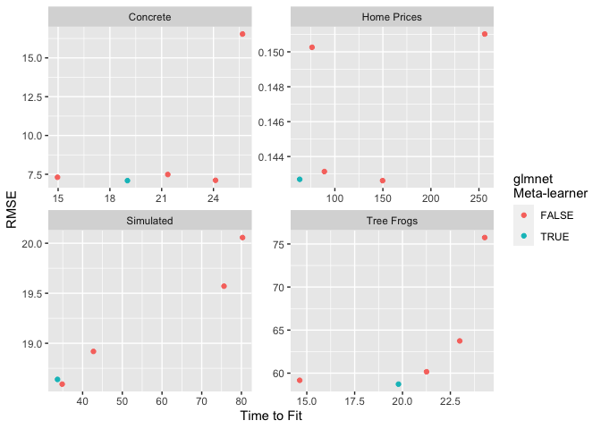

<!-- README.md is generated from README.Rmd. Please edit that file -->

# blenders

The [`general-meta` branch of
`tidymodels/stacks`](https://github.com/tidymodels/stacks/tree/general-meta)
contains experimental source code for an interface to a generalized
meta-learner in stacks. This repository contains source code for testing
the possible benefits of this functionality.

The `R` folder contains a few helper functions that are utilized in
`inst`. The script in that folder, `data-raw/blenders.Rmd`, contains
source code for generating the dataset supplied with this package. The
dataset, `stack_benchmarks`, contains coarse benchmarks on different
modeling procedures.

``` r
library(tidyverse)
library(blenders)

data(stack_benchmarks)

glimpse(stack_benchmarks)
#> Rows: 20
#> Columns: 5
#> $ model_type   <chr> "linear_reg", "linear_reg", "linear_reg", "linear_reg", "…
#> $ dataset      <chr> "Concrete", "Tree Frogs", "Simulated", "Ames Housing", "C…
#> $ metric       <chr> "rmse", "rmse", "rmse", "rmse", "rmse", "rmse", "rmse", "…
#> $ metric_value <dbl> 6.851051, 63.279304, 18.747218, 41098.057692, 7.408634, 5…
#> $ time_to_fit  <dbl> 35.493, 40.375, 75.217, 93.208, 54.252, 46.524, 120.256, …
```

Notably, the `model_type` column indicates the meta-learner learner
used. For several different datasets, we record the time to fit and a
metric value.

``` r
stack_benchmarks %>%
  mutate(
    glmnet_meta = if_else(model_type == "linear_reg", TRUE, FALSE)
  ) %>%
  ggplot() +
  aes(x = time_to_fit, y = metric_value, col = glmnet_meta) +
  geom_point() +
  facet_wrap(vars(dataset), scales = "free") +
  labs(x = "Time to Fit", y = "RMSE", col = "glmnet\nMeta-learner")
```

<!-- -->
